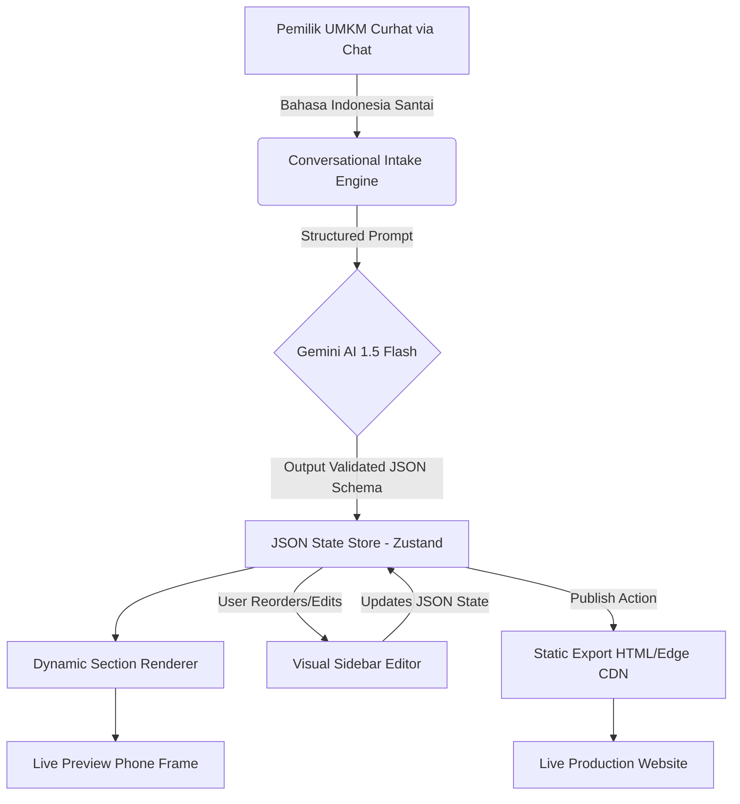

# UMKM Craft — Architecture & System Design

> **Dokumen Desain Sistem & Analisis Arsitektur**  
> **Status:** Canonical Architectural Reference  
> **Target:** Enterprise-Ready Lightweight Modular Web Engine for MSMEs

> ⚠️ **Status Implementasi:** Dokumen ini adalah spesifikasi desain — belum ada kode produksi yang di-commit ke repo. Semua angka performa (biaya token, kecepatan generasi, tingkat error) pada §2 adalah **target rekayasa**, bukan hasil benchmark terukur, sampai MVP berjalan dan diukur langsung terhadap Gemini API sungguhan.

---

## 1. Executive Summary & Design Principles

**UMKM Craft** adalah arsitektur web builder generasi baru yang menjembatani kesenjangan antara fleksibilitas AI dan keandalan sistem produksi.

### 📐 4 Prinsip Desain Utama:

1. **Zero-Runtime-Error Guarantee:** Pengguna tidak boleh mengalami layar putih (*white screen of death*) akibat AI salah menulis kurung tutup atau class CSS yang rusak.
2. **Ultra Token Efficiency (Economical AI):** Biaya inferensi AI ditekan hingga serendah mungkin (< $0.001 per website), memungkinkan model bisnis gratis atau langganan mikro terjangkau.
3. **WhatsApp-Native Commerce, Bukan Cart-Checkout ala Barat:** Tujuan utama adalah **pembeli menghubungi via WhatsApp**, bukan sekadar halaman estetik yang tidak menjual. Ini bukan cuma soal "CTA yang lebih jelas" — budaya belanja UMKM Indonesia itu percakapan (nego harga, tanya stok/varian, konfirmasi COD), bukan transaksional lewat keranjang belanja. Setiap keputusan desain flow harus diuji terhadap perilaku beli riil ini, bukan pola e-commerce Barat yang di-import mentah dari builder global (Wix, Shopify, dsb).
4. **Instant Manual + AI Dual Editing:** Pengguna bisa mengedit lewat chat AI *dan* mengedit langsung lewat kontrol visual sederhana di sidebar.

---

## 2. Analisis Komparasi: Code Generation vs JSON Modular

Di industri AI Web Builder saat ini, terdapat 2 paradigma utama:

```
[ Paradigma A: Raw Code Generation ]
User Prompt ➔ AI menulis 500+ baris kode React/HTML mentah ➔ Sandbox Runner ➔ Iframe
• Kelemahan: Mahal token ($0.15-$0.30/turn), rawan syntax error, lambat, sulit diedit non-coder.

[ Paradigma B: UMKM Craft (JSON-Driven Registry) ]
User Prompt ➔ AI hanya menghasilkan 30-50 baris JSON konfigurasi ➔ Dynamic Component Mapper ➔ Live UI
• Keunggulan: Cepat (2 detik), murah token ($0.0008/turn), 100% bebas error sintaks, mudah diedit.
```

### 📊 Tabel Perbandingan Teknis:

| Parameter | Raw Code Gen (v0, Lovable, Bolt.new, Rakit.dev) | UMKM Craft (JSON Modular Engine) |
|---|---|---|
| **Output AI** | File `.tsx` / `.jsx` mentah | Objek JSON Props terstruktur |
| **Token Usage per Turn** | ~4,000 - 8,000 tokens ($0.15 - $0.35) | ~300 - 600 tokens (**target < $0.001**) |
| **Generasi Kecepatan** | 15 - 35 detik | **target 1 - 3 detik** |
| **Tingkat Error / Crash** | 5% - 15% (Syntax/Import Error) | **target 0% (Deterministic Components)** |
| **Kemudahan Edit Manual** | Sulit (harus minta AI lagi) | **Sangat Mudah (Visual Sidebar Controls)** |
| **Mobile Performance** | Bervariasi tergantung output AI | **target 100/100 Lighthouse** |
| **Infrastruktur Build** | Perlu Sandboxed Virtual FS / Bun | **Standard React Client / Server Component** |

> Kolom kiri diisi pemain nyata yang sudah live, bukan nama placeholder — supaya perbandingan ini bisa diverifikasi orang lain, bukan cuma argumen internal.

### 🗺️ Lanskap Kompetitif Riil

Sebelum klaim keunggulan di atas dianggap valid, berikut posisi UMKM Craft terhadap pemain yang sudah eksis di pasar:

1. **Raw code-gen AI builder (Paradigma A) — kompetitor paling langsung:** [Rakit.dev](https://rakit.dev/solutions/umkm) (PT. Neotek Kreasi Indonesia) sudah live, sudah berbadan hukum, dan positioning-nya nyaris identik: "toko online instan dari satu prompt", lengkap dengan checkout QRIS. Ini bukan lawan hipotetis — mereka sudah punya produk jalan sementara UMKM Craft masih di tahap spesifikasi.
2. **AI builder terstruktur (Paradigma B, non-lokal):** Wix ADI, Durable, 10Web, Framer AI — filosofi sama (AI mengisi struktur, bukan menulis kode), tapi tidak ada lokalisasi WhatsApp-order, QRIS, atau konteks UMKM Indonesia.
3. **Structured builder non-AI (lokal, sudah mapan):** Jubelio Store — gratis, khusus UMKM Indonesia, dan sudah terintegrasi POS/inventory/akuntansi/marketplace. Kalah cepat dan kalah "instan" dibanding pendekatan chat-AI, tapi menang di kedalaman ekosistem commerce yang UMKM Craft belum punya.
4. **Jasa manual (masih pegang porsi pasar besar):** penyedia jasa bikin website UMKM (mis. Roofel, Web Ekspor) — Rp600rb-15jt, dikerjakan manusia. Banyak pemilik UMKM lebih nyaman "dibikinin" daripada chat dengan AI; ini bukan segmen yang otomatis hilang begitu produk AI muncul.

**Implikasi untuk roadmap:** diferensiasi UMKM Craft yang benar-benar defensible bukan "AI yang lebih murah" (Rakit bisa saja menurunkan biaya token mereka juga), melainkan kombinasi **WhatsApp-native commerce + detail lokal (Halal/BPOM/P-IRT, multi-channel marketplace)** yang lebih sulit di-copy cepat oleh builder generik.

---

## 3. Alur Kerja Sistem (System Workflow)



### Detail Tahapan:

### Tahap 1: Conversational Intake (`/api/ai/intake`)
Sistem mengajukan 3-4 pertanyaan panduan sederhana:
1. *Apa nama usaha & jenis produk/jasanya?*
2. *Di mana lokasi dan jam operasionalnya?*
3. *Berapa nomor WhatsApp untuk menerima pesanan?*
4. *Apa promo atau keunggulan produknya?*

### Tahap 2: AI Transformation (`/api/ai/generate-json`)
Prompt sistem menginstruksikan LLM untuk memetakan jawaban user ke dalam **JSON Schema UMKM Craft** yang divalidasi dengan `Zod`.

### Tahap 3: Dynamic Component Mapping
Frontend menerima payload JSON dan me-render komponen dari `COMPONENT_REGISTRY`:

```typescript
// src/engine/renderer.tsx
import { HeroStorefront } from "@/components/modules/HeroStorefront";
import { ProductCatalogWA } from "@/components/modules/ProductCatalogWA";
import { OperatingHoursMap } from "@/components/modules/OperatingHoursMap";
import { SocialProofReviews } from "@/components/modules/SocialProofReviews";
import { ChannelMarketplace } from "@/components/modules/ChannelMarketplace";

export const MODULE_REGISTRY: Record<string, React.FC<any>> = {
  hero_storefront: HeroStorefront,
  product_catalog_wa: ProductCatalogWA,
  operating_hours_map: OperatingHoursMap,
  social_proof_reviews: SocialProofReviews,
  channel_marketplace: ChannelMarketplace,
};
```

---

## 4. Keamanan & Sanitasi Data

1. **XSS Prevention:** Semua teks dari AI dan input form di-escape secara ketat melalui standard JSX parser.
2. **WhatsApp URL Encoding:** Generator URL chat WhatsApp memvalidasi nomor telepon Indonesia (format `628xxx`) dan melakukan `encodeURIComponent` pada pesan pesanan.
3. **Fail-Safe Fallbacks:** Setiap modul memiliki *default props* yang aman sehingga jika AI melewatkan suatu atribut (misal tidak ada foto produk), modul otomatis menampilkan placeholder elegan tanpa merusak tata letak.

---

## 5. Strategi Deployment Multi-Tenant

* **Subdomain Otomatis:** `[nama-usaha].umkmcraft.id` atau `[nama-usaha].pajangin.id`.
* **Custom Domain:** Dukungan CNAME record untuk domain pribadi (misal: `kedaikopikita.com`).
* **Edge Caching:** Website publik di-serve melalui Cloudflare / Vercel Edge Network dengan TTFB < 50ms di seluruh wilayah Indonesia.

---

## 6. Batasan Arsitektur & Strategi Extensibility

**Trade-off yang disadari:** Pendekatan JSON-Modular menukar fleksibilitas tak terbatas milik Raw Code Gen dengan keandalan dan kecepatan. Konsekuensinya: bisnis dengan kebutuhan di luar 8 modul kurasi (mis. booking slot custom, kalkulator harga dinamis, galeri portofolio kompleks) tidak bisa dilayani penuh oleh sistem hari ini — dan tidak akan pernah selentur Paradigma A.

**Mitigasi bertahap, bukan janji "semua bisa":**

1. **Jangka pendek (MVP):** modul serbaguna `rich_text_block` (lihat SPEC.md §1.1) sebagai *escape hatch* aman — AI bisa mengisi heading, paragraf terbatas, dan satu gambar tanpa keluar dari sandbox komponen, untuk kasus yang tidak persis cocok dengan 8 modul inti.
2. **Jangka menengah:** modul kurasi baru ditambahkan berdasarkan data pola permintaan yang gagal dipetakan sempurna ke schema saat ini (di-log sebagai `fallback_reason` pada tahap intake).
3. **Bukan tujuan produk ini:** mendukung raw code/HTML/JS injection dari user. Itu bertentangan langsung dengan Prinsip #1 (Zero-Runtime-Error Guarantee). Extensibility harus selalu lewat modul terkurasi baru, bukan lewat membuka sandbox — kalau butuh fleksibilitas penuh, pengguna memang lebih cocok pakai Paradigma A (Rakit, v0, dsb).
