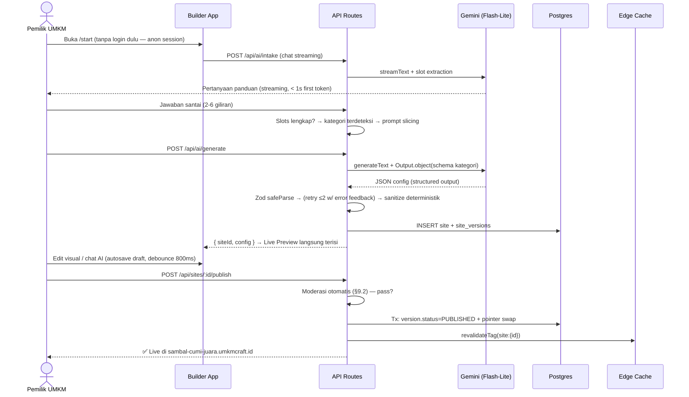

# UMKM Craft — System Design v2.0

> **Dokumen Desain Sistem Lengkap (Full-Stack, End-to-End)**  
> **Status:** Proposal Arsitektur — hasil audit terhadap SPEC/ARCHITECTURE/COMPONENTS/ROADMAP + riset internet (Sep 2026)  
> **Dokumen ini men-supersede** bagian teknis ARCHITECTURE.md yang menyimpang, dan **melengkapi** (bukan mengganti) spesifikasi produk.

---

## 0. Ringkasan Temuan Riset (Mengapa Dokumen Ini Dibuat)

Riset internet memunculkan **koreksi hard** terhadap asumsi di dokumen lama:

| # | Temuan | Sumber | Dampak |
|---|---|---|---|
| 1 | **Gemini 1.5 (Pro/Flash/Flash-8B) sudah di-shutdown permanen 29 Sep 2025.** Semua referensi "Gemini 1.5 Flash" di README/ARCHITECTURE/ROADMAP menunjuk ke model yang sudah mati. | [Gemini API changelog](https://ai.google.dev/gemini-api/docs/changelog), [model lifecycle](https://docs.cloud.google.com/gemini-enterprise-agent-platform/models/model-versions) | 🔴 Semua doc harus diganti ke Gemini 2.5 Flash-Lite (ekonomis) / Gemini 3.x Flash (kualitas) |
| 2 | **Next.js stabil terkini adalah v16.x** (Turbopack default, `middleware.ts` → **`proxy.ts`** dengan **Node.js runtime — tidak ada edge runtime**), model caching baru `cacheComponents` (`'use cache'` + `cacheTag`). README menyebut Next.js 15. | [Next.js 16 blog](https://nextjs.org/blog/next-16), [konvensi proxy.js](https://nextjs.org/docs/app/api-reference/file-conventions/proxy) | 🔴 Update tech stack; pola routing multi-tenant memakai `proxy()` |
| 3 | **Vercel AI SDK 6** stabil — API structured output kini `generateText`/`streamText` + `Output.object({ schema })` dengan `partialOutputStream` untuk streaming partial object. | [AI SDK 6](https://vercel.com/blog/ai-sdk-6), [structured data docs](https://ai-sdk.dev/docs/ai-sdk-core/generating-structured-data) | 🟡 Pola integrasi AI di ARCHITECTURE §3 perlu disesuaikan |
| 4 | **Harga Gemini (per 1M token, paid tier):** 2.5 Flash-Lite ≈ $0.05 input / $0.20 output (cached $0.005); 2.5 Flash ≈ $0.30/$2.50; Gemini 3.x Flash promosi $0.375/$1.875 s.d. akhir 2026. Implicit caching otomatis untuk model 2.5+ (cached token = 10% harga input). | [Gemini pricing](https://ai.google.dev/gemini-api/docs/pricing), [Vertex caching blog](https://cloud.google.com/blog/products/ai-machine-learning/vertex-ai-context-caching), [pricepertoken](https://pricepertoken.com/pricing-page/model/google-gemini-2.5-flash-lite) | 🟢 Target <$0.001/generasi **tercapai dengan Flash-Lite** (hitungan di §7.5). Tapi free tier Gemini dipangkas (≈5–15 RPM) → produksi wajib paid tier (≈150–300 RPM) |
| 5 | **Website builder adalah vektor phishing favorit** — ±11,57% URL phishing dilaporkan berasal dari subdomain provider; Unit42 mendokumentasikan pola "platform-abuse phishing" di website builder. | [Unit42: Platform Abuse Phishing](https://unit42.paloaltonetworks.com/platform-abuse-phishing/), [OXIL](https://oxil.uk/news/use-of-subdomain-providers-gains-popularity-as-a-mechanism-to-launch-phishing-attacks) | 🔴 Doc lama **tidak punya cerita anti-abuse sama sekali**. Desain di §9 wajib: moderasi publish, blok slug merek, tombol lapor, Safe Browsing |
| 6 | **Cloudflare for SaaS** adalah solusi standar industri untuk custom domain tenant (custom hostname + SSL otomatis + renewal). | [CF for SaaS](https://developers.cloudflare.com/cloudflare-for-platforms/cloudflare-for-saas/), [use case custom domains](https://developers.cloudflare.com/use-cases/saas/custom-domains/) | 🟢 Validasi strategi custom domain di Fase 4 |
| 7 | **Prisma stabil terkini = v7** (Rust-free client, `prisma.config.ts`); repo kini `prisma/orm`, v8 sudah RC. | [Prisma 7 announcement](https://www.prisma.io/blog/announcing-prisma-orm-7-0-0) | 🟡 README menyebut "Prisma ORM" generik — pin versi eksplisit |
| 8 | React stabil terkini 19.2.x; Tailwind stabil terkini v4 (CSS-first, OKLCH native — cocok dengan COMPONENTS.md). | [React versions](https://react.dev/versions) | 🟢 Sync versi di README |

**Kesimpulan riset:** arah arsitektur JSON-Modular (Paradigma B) di ARCHITECTURE.md **tetap valid dan didukung bukti** — pola serupa dipakai Wix ADI/Durable, dan biaya per-generasi memang bisa ditekan <$0.001 dengan model Lite-tier. Yang hilang dari dokumen lama adalah **lapisan sistem**: data model multi-tenant, publish pipeline, versioning, keamanan/abuse, media, analytics, dan observability. Dokumen ini mengisi itu semua.

---

## 1. Gambaran Sistem (Bird's Eye View)

UMKM Craft secara fungsional adalah **dua produk dalam satu sistem**:

1. **Builder App** (`umkmcraft.id`, `app.umkmcraft.id`) — aplikasi interaktif (auth, chat AI, editor visual, dashboard) yang **selalu dinamis**.
2. **Published Sites** (`*.umkmcraft.id` + custom domain) — ribuan situs tenant yang **statis secara sifat** (berubah hanya saat publish), dibaca publik + Googlebot, dengan requirement latency & SEO ketat.

```mermaid
graph TD
    subgraph Client
        U[Pemilik UMKM - Browser/HP]
        V[Pembeli - Browser/HP]
    end

    subgraph Edge["Edge / CDN (Cloudflare)"]
        DNS["DNS: *.umkmcraft.id wildcard<br>+ CF for SaaS custom hostnames"]
        WAF["WAF + Rate limit + Bot fight"]
    end

    subgraph App["Aplikasi Next.js 16 (satu deployment)"]
        B["Builder App<br/>(auth, chat AI, editor)"]
        P["Site Renderer<br/>(RSC, host-based routing)"]
        API["API Routes<br/>/api/ai/* /api/sites/* /api/assets/* /api/t"]
    end

    subgraph AI["AI Layer"]
        G["Gemini 2.5 Flash-Lite<br/>(structured output)"]
        G2["Gemini 3.x Flash<br/>(fallback / polish)"]
    end

    subgraph Data["Data Layer"]
        PG[(Postgres<br/>Neon/Supabase)]
        R2[(R2 Object Storage<br/>gambar tenant)]
        KV[(Upstash Redis<br/>rate limit + cache)]
    end

    U --> DNS --> WAF --> B --> API
    V --> DNS --> WAF --> P
    API --> G & G2
    API --> PG & R2 & KV
    P --> PG --> "published snapshot"
```

**Prinsip yang dibawa dari ARCHITECTURE.md (tetap berlaku):**
- Zero-Runtime-Error Guarantee → komponen deterministik + validasi Zod ketat.
- Token efficiency → JSON modular, prompt slicing per kategori.
- WhatsApp-native commerce → setiap flow diuji terhadap perilaku "nego via chat".
- Dual editing (AI chat + kontrol visual).

---

## 2. Keputusan Arsitektur Utama (ADR — Architecture Decision Records)

### ADR-1: Satu deployment Next.js untuk Builder + Published Sites, host-based routing

**Keputusan:** Satu aplikasi Next.js 16. `proxy.ts` (pengganti middleware, Node runtime) membaca header `Host`:

```
umkmcraft.id | www | app | dashboard  → route group (builder)
<slug>.umkmcraft.id | custom domain   → rewrite ke /sites/[...path] (site renderer)
api.umkmcraft.id                      → (opsional v2) split API
```

```typescript
// proxy.ts (Next.js 16 — menggantikan middleware.ts)
import { NextResponse } from "next/server";
import type { NextRequest } from "next/server";

const BUILDER_HOSTS = new Set(["umkmcraft.id", "www.umkmcraft.id", "app.umkmcraft.id", "localhost"]);

export function proxy(request: NextRequest) {
  const host = request.headers.get("host") ?? "";
  const isBuilder = BUILDER_HOSTS.has(host) || host.endsWith(".vercel.app") || host.endsWith(".localhost");
  if (isBuilder) return NextResponse.next();

  // tenant host → rewrite ke renderer
  const url = request.nextUrl.clone();
  url.pathname = `/sites${url.pathname === "/" ? "/index" : url.pathname}`;
  const res = NextResponse.rewrite(url);
  res.headers.set("x-tenant-host", host);
  return res;
}

export const config = { matcher: ["/((?!_next|api|favicon.ico).*)"] };
```

**Alternatif yang ditolak (untuk MVP):**
- *Static export per tenant ke R2 saat publish* (build-per-publish): serving termurah & TTFB terbaik di Indonesia (PoP Cloudflare Jakarta), tapi menambah pipeline + parity issue preview vs produksi. **Disiapkan sebagai jalur evolusi** (lihat ADR-2) — renderer wajib berupa pure function agar migrasi murah.
- *Satu container per tenant / SSR penuh tanpa cache:* boros dan lambat.

### ADR-2: Published site = render dari **immutable published snapshot**, bukan dari draft

Draft dan live dipisah total. Tenant site **tidak pernah** membaca data yang sedang diedit.

```
sites ──< site_versions (immutable)          domains
             │  status: draft|published|archived
             └──> sites.published_version_id  (pointer tunggal)
```

- **Publish** = transaksi atomik: buat `site_versions` baru berstatus `published` → pindahkan pointer → purge cache → selesai. Tidak ada "setengah ter-publish".
- **Rollback** = pindahkan pointer ke versi sebelumnya (gratis, instan).
- **Cache invalidation** = `revalidateTag('site:{site_id}')` (idiom Next 16 `cacheComponents`: `'use cache'` + `cacheTag` di server component renderer).
- Strategi rendering halaman tenant: **dynamic render + cache penuh per-host** (cache-hit = edge cache; cache-miss = 1 query Postgres + render RSC — config tenant ukurannya puluhan KB, render < 50ms). Fallback safety: `revalidate` waktu (mis. 24 jam) agar stale cache tidak pernah abadi.

Ini menjawab target "TTFB < 50ms" secara realistis: TTFB tercapai untuk cache-hit di edge; cache-miss tetap sub-200ms dari Singapore.

### ADR-3: AI = dua fase (chat → structured generation), bukan satu prompt raksasa

**Fase 1 — Intake chat** (`/api/ai/intake`): `streamText` biasa (teks santai bahasa Indonesia), engine mengekstrak *slot* (nama usaha, kategori, lokasi, nomor WA, produk, promo) secara progresif. Slot tracking dilakukan deterministik di server (state machine), bukan dipercaya ke teks LLM.

**Fase 2 — Generation** (`/api/ai/generate`): satu panggilan `generateText` + `Output.object({ schema })` (AI SDK 6) dengan Zod schema hasil *prompt slicing* kategori. Output divalidasi → di-repair → di-sanitize deterministik (§7.3).

**Alasan dua fase:** hemat token (chat phase pakai model termurah & output pendek), UX streaming natural, dan kegagalan fase 2 bisa di-retry tanpa mengulang percakapan.

### ADR-4: Multi-tenancy = shared database, isolasi by-design

- Satu cluster Postgres, skema shared, semua tabel tenant-scoped punya `site_id`/`user_id` + index komposit. Row-Level Security (Postgres RLS) **diaktifkan** sebagai jaring pengaman kedua di belakang cek aplikasi.
- Subdomain = slug unik global, dengan **reserved-words list** (`www, app, api, admin, dashboard, mail, ftp, bca, bri, mandiri, tokopedia, shopee, gojek, grab, jenius, dana, ovo, gopay, qris, bank, kemenkeu, pertamina, pln, ...`) — melawan impersonation phishing (temuan riset #5).
- Custom domain (Fase 4): Cloudflare for SaaS — user tambah CNAME → sistem verifikasi ownership → certificate provisioning otomatis. Aplikasi TIDAK perlu tahu apa-apa selain tabel `domains`.

### ADR-5: Deployment — mulai di Vercel, renderer tetap portabel

| Kriteria | Vercel | Cloudflare Pages/Workers (OpenNext) | Self-host (Coolify/Dokploy di VPS SG/Jakarta) |
|---|---|---|---|
| Time-to-MVP | ⭐⭐⭐ tercepat | ⭐⭐ perlu penyesuaian | ⭐ DevOps sendiri |
| Latency Indonesia | ⭐⭐ origin Singapore, mitigasi via edge cache | ⭐⭐⭐ PoP Jakarta | ⭐⭐⭐ kalau VPS di SG/JKT + CF depan |
| Biaya di skala ribuan tenant | naik signifikan | paling murah | murah tapi on-call sendiri |
| revalidateTag/ISR | native | via OpenNext adapter | native (self-host Next) |

**Keputusan:** MVP di Vercel (kecepatan iterasi > segalanya di fase validasi). Konsekuensi yang dipaksakan sejak hari-1: **renderer dan seluruh module registry harus pure (`config → React tree`), tanpa import apa pun dari builder** — sehingga pindah ke CF/self-host atau pre-render ke R2 (ADR-1 alternatif) tidak memerlukan rewrite.

---

## 3. Struktur Monorepo & Boundary Modul

Struktur yang memaksa boundary ADR-2/ADR-5 sejak awal (pnpm workspace + Turbopack):

```
umkmcraft/
├─ apps/
│  └─ web/                        # satu app Next.js 16 (builder + renderer + api)
│     ├─ proxy.ts                 # host-based routing (ADR-1)
│     ├─ app/
│     │  ├─ (builder)/            # auth, chat, editor, dashboard  [dinamis]
│     │  ├─ sites/[...path]/      # renderer publik tenant        [cache-heavy]
│     │  └─ api/                  # route handlers
│     └─ next.config.ts
├─ packages/
│  ├─ schema/                     # Zod 4: UmkmWebsiteConfig + discriminated union
│  │  ├─ src/v1/…                 # versi schema (lihat §4.3)
│  │  └─ src/migrate.ts           # migrasi antar config_version
│  ├─ renderer/                   # MODULE_REGISTRY + 13 modul — PURE, zero builder import
│  │  ├─ src/modules/*.tsx        # RSC by default; client island hanya bila interaktif
│  │  └─ src/theme/               # preset warna + CSS vars
│  ├─ ai/                         # prompt templates, slicing, generate+repair loop
│  └─ utils/                      # whatsapp.ts, rupiah.ts, slug.ts, moderation.ts
└─ tooling/                       # eslint, tsconfig, golden fixtures renderer
```

Aturan yang di-enforce lint (dependency-cruiser/ESLint boundaries): `renderer` dan `schema` **dilarang** mengimpor dari `apps/web`. Inilah jaminan mekanis bahwa "situs publik" tidak pernah bocor logika builder dan bisa diekstrak kapan pun.

---

## 4. Data Model (Postgres + Prisma 7)

### 4.1 Skema relasional

```prisma
// schema.prisma (Prisma 7 — rust-free client, prisma.config.ts)

model User {
  id            String   @id @default(cuid())
  email         String   @unique
  name          String?
  image         String?
  plan          Plan     @default(FREE)
  createdAt     DateTime @default(now())
  sites         Site[]
  aiUsage       AiUsage[]
  sessions      Session[]
}

model Site {
  id                  String   @id @default(cuid())
  ownerId             String
  owner               User     @relation(fields: [ownerId], references: [id])
  slug                String   @unique            // sambal-cumi-juara -> subdomain
  businessCategory    String                     // kuliner | barbershop | ...
  status              SiteStatus @default(DRAFT) // DRAFT | PUBLISHED | SUSPENDED | DELETED
  publishedVersionId  String?  @unique           // pointer atomik (ADR-2)
  publishedVersion    SiteVersion? @relation("PublishedVersion", fields: [publishedVersionId], references: [id])
  versions            SiteVersion[] @relation("SiteVersions")
  domains             Domain[]
  assets              Asset[]
  events              AnalyticsEvent[]
  aiUsage             AiUsage[]
  reportCount         Int      @default(0)
  createdAt           DateTime @default(now())
  updatedAt           DateTime @updatedAt
  @@index([ownerId, status])
}

model SiteVersion {
  id            String   @id @default(cuid())
  siteId        String
  site          Site     @relation("SiteVersions", fields: [siteId], references: [id])
  versionNumber Int
  configVersion Int      @default(1)              // schema versioning, lihat §4.3
  configJson    Json                            // payload UmkmWebsiteConfig tervalidasi
  status        VersionStatus @default(DRAFT)   // DRAFT | PUBLISHED | ARCHIVED
  changeSource  ChangeSource @default(MANUAL)  // AI_GENERATION | MANUAL | AI_EDIT
  publishedAt   DateTime?
  createdAt     DateTime @default(now())
  @@unique([siteId, versionNumber])
  @@index([siteId, status])
}

model Domain {
  id           String  @id @default(cuid())
  siteId       String
  site         Site    @relation(fields: [siteId], references: [id])
  hostname     String  @unique                // kedaikopikita.com
  status       DomainStatus @default(PENDING) // PENDING | VERIFIED | ACTIVE | FAILED
  verifiedAt   DateTime?
  // CF for SaaS: custom hostname id, cert status, dsb (Fase 4)
}

model Asset {
  id        String   @id @default(cuid())
  siteId    String
  site      Site     @relation(fields: [siteId], references: [id])
  r2Key     String   @unique              // sites/{siteId}/{assetId}.webp
  mime      String
  sizeBytes Int
  width     Int?
  height    Int?
  blurDataUrl String?                     // LQIP untuk CLS=0
  createdAt DateTime @default(now())
  @@index([siteId])
}

model AiUsage {
  id           String   @id @default(cuid())
  userId       String
  user         User     @relation(fields: [userId], references: [id])
  siteId       String?
  site         Site?    @relation(fields: [siteId], references: [id])
  kind         AiKind                    // INTAKE | GENERATE | EDIT | POLISH | MODERATE
  model        String                    // gemini-2.5-flash-lite
  inputTokens  Int
  outputTokens Int
  cachedTokens Int       @default(0)
  costUsdMicro Int                       // biaya dalam micro-USD (hemat presisi)
  latencyMs    Int
  status       AiStatus                  // OK | VALIDATION_RETRY | FAILED
  createdAt    DateTime @default(now())
  @@index([userId, createdAt])
  @@index([siteId])
}

model AnalyticsEvent {                   // lihat §8 — sendBeacon endpoint
  id        BigInt   @id @default(autoincrement())
  siteId    String
  site      Site     @relation(fields: [siteId], references: [id])
  type      EventType                     // PAGEVIEW | WA_CLICK | WA_PRODUCT_CLICK | OUTBOUND
  productId String?                       // prod-1 dari config
  path      String?
  ref       String?
  country   String?
  device    String?                       // mobile|desktop (dari UA, tanpa fingerprint)
  ts        DateTime @default(now())
  @@index([siteId, type, ts])
}

model AbuseReport {
  id        String   @id @default(cuid())
  siteId    String
  reason    ReportReason                   // PHISHING | IMPERSONATION | SCAM | ILLEGAL | OTHER
  detail    String?
  status    ReportStatus @default(OPEN)   // OPEN | REVIEWING | ACTIONED | DISMISSED
  createdAt DateTime @default(now())
}
```

### 4.2 Kenapa snapshot immutable, bukan satu kolom JSON yang di-update terus

1. **Zero surprise di production:** situs live tidak mungkin berubah karena editor tersimpan autosave.
2. **Rollback instan** — kebutuhan wajib untuk fitur "Riwayat Versi" yang murah dijelaskan ke UMKM.
3. **Audit & debugging** — bug laporan "websitenya berubah sendiri" bisa ditelusuri per versi.
4. **Moderasi** — ban/suspend = pindahkan `Site.status`, bukan menghapus data.

### 4.3 Versioning schema konfigurasi (yang belum ada sama sekali di doc lama)

`configJson` disimpan **bersama `configVersion`**. Aturan:

- `packages/schema/src/v1/` = schema sesuai SPEC.md saat ini. Perubahan breaking → folder `v2/` + fungsi migrasi murni `migrateV1toV2(config) → config`.
- Saat load: `const migrated = migrate(configJson, configVersion)` → selalu hasilkan versi terbaru sebelum render/edit. Migrasi wajib punya test golden round-trip.
- `$schema` di JSON (SPEC.md §1) dipakai sebagai penanda versi juga, konsisten dengan `configVersion`.

---

## 5. Alur Kerja Lengkap (Sequence)

### 5.1 Dari curhat sampai live (happy path)



Catatan desain penting: **anon-first onboarding** (buat site sebelum signup). Signup (Google OAuth / email OTP) diminta tepat sebelum publish — mengikuti pola produk viral (kurangi friksi, simpan draft di cookie/localStorage + server anon session).

### 5.2 Pembeli membuka situs tenant

```
GET sambal-cumi-juara.umkmcraft.id
  → Cloudflare edge (cache HIT? → selesai, TTFB < 50ms)
  → proxy.ts: host bukan builder → rewrite /sites/index
  → RSC: lookup host→site (cached, tag: host:{host}) → published_version → config
  → render MODULE_REGISTRY (RSC, 0 JS kecuali island)
  → Cache-Control: public, s-maxage=86400, stale-while-revalidate=604800
  → tag: site:{site_id} (untuk revalidateTag saat publish)
```

---

## 6. Site Renderer — Kontrak yang Membuat "Zero-Runtime-Error" Nyata

Doc lama menjamin zero-error secara retoris. Ini mekanismenya, lapis demi lapis:

| Lapis | Mekanisme | Kegagalan yang dicegah |
|---|---|---|
| 1. Schema | **Discriminated union per tipe section** — BUKAN `props: z.record(z.any())` seperti SPEC.md §2 sekarang. Props hero divalidasi oleh `HeroPropsSchema`, katalog oleh `CatalogPropsSchema`, dst. | AI mengarang field, tipe salah, harga negatif, nomor WA invalid |
| 2. Sanitizer deterministik | `sanitizeConfig()` murni TypeScript: clamp panjang string, strip URL non-allowlist (`https:` only), validasi hex/oklch color, resolve `section.id` duplikat, coerce angka | Nilai "hampir benar" yang lolos schema |
| 3. Default props per modul | Setiap modul wajib punya `defaultProps` + render placeholder elegan jika `image_url` kosong/rusak (sudah di ARCHITECTURE §5 — sekarang jadi kontrak wajib + test) | Fail-safe fallback |
| 4. Renderer pure | `renderSections(config) → ReactNode` tanpa efek samping, tanpa `window`, RSC by default. Client JS hanya island: `FaqAccordion`, `GalleryLightbox`, `PromoTimer`, `CopyCoupon`, `Tabs` | Hydration mismatch, white screen |
| 5. Test golden | Fixture config per kategori bisnis (kuliner, barbershop, laundry, jasa) → snapshot render HTML + property-based test (fast-check) yang generate config acak → `safeParse` + render tidak pernah throw | Regressi engine |

Contoh discriminated union (perbaikan atas SPEC.md §2):

```typescript
// packages/schema/src/v1/sections.ts
import { z } from "zod";

export const SectionSchema = z.discriminatedUnion("type", [
  z.object({ id: z.string(), type: z.literal("hero_storefront"), props: HeroPropsSchema }),
  z.object({ id: z.string(), type: z.literal("product_catalog_wa"), props: CatalogPropsSchema }),
  z.object({ id: z.string(), type: z.literal("operating_hours_map"), props: HoursPropsSchema }),
  // ...13 modul, semua props typed
]);
```

Dengan ini, **AI yang berhalusinasi field tidak pernah sampai ke renderer** — error ditangkap di API layer, di-repair, atau di-drop dengan log.

---

## 7. AI Layer — Detail Teknis

### 7.1 Pemilihan model (koreksi atas doc lama)

| Peran | Model | Harga (per 1M token) | Alasan |
|---|---|---|---|
| Intake chat + generation + edit | **`gemini-2.5-flash-lite`** | ~$0.05 in / ~$0.20 out (cek [pricing](https://ai.google.dev/gemini-api/docs/pricing) saat implementasi) | Termurah di kelasnya; structured output supported; context 1M |
| Fallback generation (retry ke-3) & Magic Polish | `gemini-2.5-flash` atau `gemini-3.x-flash` | ~$0.30/$2.50 | Kualitas copywriting lebih baik untuk retry |
| Moderasi konten publish | `gemini-2.5-flash-lite` + safety settings | ~$0.05 in | Klasifikasi teks murah |

Model string **wajib jadi env var / DB config** (`AI_MODEL_PRIMARY`), bukan hardcode — pelajaran dari kematian Gemini 1.5: model generational itu perishable.

### 7.2 Structured output + streaming (AI SDK 6)

```typescript
// packages/ai/src/generate.ts
import { generateText, Output } from "ai";
import { google } from "@ai-sdk/google";

export async function generateConfig({ slots, category }: GenerateInput) {
  const { output, usage } = await generateText({
    model: google(process.env.AI_MODEL_PRIMARY!),   // gemini-2.5-flash-lite
    system: buildSlicedSystemPrompt(category),       // prompt slicing (§7.4)
    prompt: renderSlots(slots),
    output: Output.object({ schema: categorySchema(category) }), // discriminated union subset
    maxOutputTokens: 4000,
    abortSignal: AbortSignal.timeout(20_000),
  });
  return { config: output, usage };
}
```

- **Streaming UX:** gunakan `streamText` + `partialOutputStream` untuk mengisi Live Preview **per-section secara progresif** (hero muncul → katalog muncul). Persepsi kecepatan jauh lebih penting daripada latency aktual; target "2 detik" di doc lama secara realistis adalah *time-to-first-section*, bukan time-to-full-config.
- **Retry & repair loop (maks 2 retry):**
  1. Zod `safeParse` gagal → kirim kembali error path + payload mentah ke model: `"JSON kamu gagal validasi: {issues}. Perbaiki dan keluarkan ulang JSON penuh."`
  2. Masih gagal → turun kelas ke model fallback (2.5-flash / 3.x-flash).
  3. Masih gagal → **graceful degradation**: render site dari template default kategori + data slot yang valid (nama, WA, alamat), tandai sesi `NEEDS_MANUAL_EDIT`. User tidak pernah melihat error 500 — konsisten dengan Prinsip #1.

### 7.3 Sanitasi deterministik pasca-AI (selalu jalan, bukan opsional)

```typescript
// packages/utils/src/sanitize.ts
- clampString(str, max)          // judul ≤ 80, deskripsi ≤ 500, FAQ ≤ 1000
- sanitizeUrl(u)                 // allowlist: https: saja; blokir javascript:, data:
- sanitizeColor(c)               // regex ^#([0-9a-f]{6})$ atau oklch(...) valid
- normalizeWaNumber(n)           // 62…, regex sudah ada di SPEC — tambahkan blokir nomor premium/special
- dedupeSectionIds(sections)     // regenerasi id dengan nanoid jika duplikat
- stripUnknownProps(section)     // zod .strip()
```

### 7.4 Prompt slicing + caching (realita vs klaim)

- Slicing per kategori (ARCHITECTURE §4) **tetap benar** — ini menjaga prompt ~300–800 token.
- Nuansa yang harus jujur dicatat: implicit caching Gemini baru aktif untuk prompt yang cukup besar dan hanya menghemat 10% dari input. **Dengan prompt sekecil ini, caching bukan penghematan yang material — jangan over-engineer.** Simpan prefix system prompt stabil (identik antar-request) agar implicit caching bisa "kebetulan" kena, ukur via `cachedTokens` di tabel `AiUsage`, baru optimasi jika data menunjukkan perlu.

### 7.5 Ekonomi token — audit target <$0.001

Estimasi per generasi lengkap (Flash-Lite):

```
Input : system prompt (kategóri sliced) ~600 token + slot history ~400 token = ~1.000 token
Output: config JSON lengkap            ≈ 1.200–1.800 token

Biaya  = 1.000 × $0.05/1M + 1.500 × $0.20/1M ≈ $0.00005 + $0.0003 ≈ $0.00035 ✅
```

Dengan P95 retry (±30% generasi butuh 1 retry): ≈ $0.00045/generasi. **Target <$0.001 valid, dengan margin ~2×.** Catatan: angka ini pakai harga Lite; kalau terpaksa jatuh ke model Flash biasa, biaya naik ~6× ($0.002–0.003) dan target bolong — itulah kenapa Flash-Lite adalah pilihan struktural, bukan selera. Tambahkan kolom `costUsdMicro` di `AiUsage` supaya klaim ini **diukur, bukan diasumsikan** (ARCHITECTURE.md sudah jujur menyebut semua angka adalah target — tabel `AiUsage` adalah cara membuktikannya).

### 7.6 Rate limit & kuota (biaya AI = satu-satunya marginal cost signifikan)

| Aksi | Anonim (per IP) | User free (per hari) | Catatan |
|---|---|---|---|
| Chat intake | 30 msg/jam | 100 msg | model termurah, longgar |
| Generate full site | 3 | 10 | after: hard-stop + upsell |
| AI edit/polish | — | 50 | |
| Publish | — | 5 | mencegah churn spam |

Implementasi: `@upstash/ratelimit` (sliding window, Redis) + Cloudflare Turnstile pada aksi generate dari IP anon. Tanpa ini, satu aktor jahat bisa membakar puluhan dolar per jam — dan riset #5 menunjukkan aktor seperti itu benar-benar ada dan menarget builder.

---

## 8. Analytics Tenant — WA Click Tracking

WhatsApp click = **metrik utama product-market fit** (satu-satunya konversi di model WA-native). Desain minimalis, tanpa cookie, tanpa fingerprint:

```
// Di situs tenant (client island ~40 baris):
navigator.sendBeacon("/api/t", JSON.stringify({
  t: "wa_click",          // | pageview | wa_product_click | outbound
  p: "prod-1",            // product id, opsional
  r: document.referrer,   // referrer
}))
→ POST /api/t → 204 No Content, insert AnalyticsEvent (fire-and-forget, tanpa PII)
```

- **Tidak pakai redirect `/go?...`** — link WA tetap `wa.me` langsung. Redirect menambah failure point pada momen paling penting (user mau order); beacon cukup andal untuk `sendBeacon` (fire-and-forget bahkan saat tab closing).
- Dashboard tenant: pageview harian, WA click, **WA click per produk** (jawab "produk paling populer" di ROADMAP Fase 4), referrer top.
- Agregasi: query SQL langsung cukup sampai ±1 juta event/bulan (index di `[siteId, type, ts]`); setelah itu pindah ke tabel harian pre-agg atau Cloudflare Analytics Engine.
- Bot filtering sederhana (UA list) + dedupe refresh 30 detik per session-key (cookieless: hash(ip+ua+date) — rotasi harian, GDPR/PDP-safe).

Alternatif yang dipertimbangkan & ditunda: self-host Umami/Plausible (bagus, tapi dashboard per-tenant dalam produk butuh embedding & API yang lebih dalam dari yang mereka berikan).

---

## 9. Keamanan, Anti-Abuse, dan Moderasi (bagian yang paling hilang dari doc lama)

### 9.1 Ancaman konkret (berbasis riset #5)

Website builder gratis dengan subdomain otomatis = rumah impian phisher (halaman "BCA simulasi deposit", "Shopee pengecekan paket palsu", dll). Dampak kalau tidak dikelola: domain `umkmcraft.id` masuk blocklist Google Safe Browsing / antivirus → **seluruh bisnis mati sekaligus**, dan UMKM jujur ikut kena. Ini risiko eksistensial, bukan fitur nice-to-have.

### 9.2 defenses berlapis

| Lapis | Mekanisme | Kapan |
|---|---|---|
| Pencegahan | Reserved slug list (merek bank/marketplace/pemerintah) + regex blokir (`login|verify|daftar.*bonus|saldо`…) pada slug & judul situs | saat generate & rename |
| Pencegahan | Tidak ada HTML/JS injection by design (hanya modul terkurasi; markdown dirender `react-markdown` **tanpa** `rehype-raw`) | selalu |
| Pencegahan | URL sanitization (https-only allowlist) di semua `image_url`, `gmaps_url`, `channels[].url` | setiap render |
| Deteksi | **Moderasi otomatis saat publish pertama & saat perubahan besar:** panggilan Gemini flash-lite (~200 token) klasifikasi konten + Gemini safety settings; URL outbound dicek ke **Google Safe Browsing Lookup API v4** | publish |
| Deteksi | Tombol **"Laporkan situs"** di footer tenant → `AbuseReport` → admin queue | selalu |
| Respons | `Site.status = SUSPENDED` → renderer menampilkan halaman "Situs ditangguhkan" (bukan 404 kosong); SLA review laporan < 24 jam; log takedown | insiden |
| Perimeter | Cloudflare WAF + Bot Fight Mode + rate limit edge; Turnstile di signup/generate | selalu |
| Header | Published sites: CSP `script-src 'self'`, `frame-ancestors 'none'`, X-Content-Type-Options, Referrer-Policy | selalu |

### 9.3 Keamanan aplikasi standar

- Auth: **Auth.js v5** — Google OAuth (utama; pemilik UMKM rata-rata punya akun Google/Android) + email OTP fallback. Session cookie httpOnly.
- Otorisasi: setiap endpoint memverifikasi `session.user.id === site.ownerId` (dan RLS Postgres sebagai jaring kedua).
- Upload: presigned PUT R2 (§10) — server menandatangani, browser upload langsung; validasi mime + size ≤ 5 MB + magic-byte check.
- Secrets: Gemini API key hanya di server (AI routes adalah server-only). Kunci model di env, rotasi mudah.

---

## 10. Media Pipeline (Gambar Tenant)

```
Editor: pilih file → POST /api/assets/presign {siteId, mime, size}
        → server validasi kuota (free: 20 gambar/site, ≤5MB, jpeg/png/webp)
        → return { uploadUrl (R2 presigned PUT, exp 5m), assetId }
Browser → PUT langsung ke R2 (tidak melewati server — hemat bandwidth)
        → POST /api/assets/confirm → server ambil metadata + generate blurDataUrl
Render  → https://cdn.umkmcraft.id/sites/{siteId}/{assetId}.webp
```

- R2 bucket dengan **custom domain `cdn.umkmcraft.id`** (Cloudflare cache di depan, `Cache-Control: immutable` — key mengandung assetId sehingga aman cache selamanya).
- Optimasi: MVP pakai `next/image` default optimizer di builder; untuk **situs tenant**, image di-resize saat upload (sharp di server: max 1600px, konversi webp, simpan width/height + `blurDataUrl`) → renderer memakai `` statis dengan width/height eksplisit → **CLS = 0 tanpa image optimizer runtime** (membuat pre-render ke R2 di masa depan tetap mungkin).
- `original_price`, foto produk rusak/404 → placeholder per kategori (bagian dari defaultProps contract §6).

---

## 11. SEO & Distribusi (pelengkap ROADMAP Fase 4)

- `generateMetadata` per tenant: title/description dari `meta.seo`, canonical ke subdomain tenant, `openGraph` + **OG image dinamis** (satori/@vercel/og: nama usaha + tagline + warna tema). **OG image = prioritas tinggi secara khusus untuk pasar ini:** link UMKM dibagikan lewat WhatsApp group — preview kartu yang menarik di WA adalah saluran akuisisi organik gratis.
- JSON-LD `LocalBusiness` (dari modul `operating_hours_map` + `contact_direct`) + `Product`/`Offer` untuk katalog.
- `/sitemap.xml` + `/robots.txt` per tenant host (route handler kecil, cached).
- `<html lang="id">` global.

---

## 12. Observability & Operasional

| Aspek | Tool | Alarm |
|---|---|---|
| Error tracking | Sentry (SDK Next.js) | error rate renderer > 0,5% — target riil adalah 0 |
| AI economics | tabel `AiUsage` + cron harian → dashboard (biaya/user, biaya/situs, retry rate) | cost/generation > $0.001 P50 selama 1 hari |
| Uptime | Better Stack / UptimeRobot ping `/api/health` | down 2 menit |
| Latensi situs tenant | Cloudflare Analytics + RUM sederhana (beacon `t:perf` dengan `navigation.timing`) | p75 LCP > 2,5s |
| DB | Neon/Supabase: PITR aktif + dump harian ke R2 | — |

---

## 13. Testing Strategy (menopang janji Zero-Runtime-Error)

1. **Unit (vitest):** schema Zod (incl. kasus graciously-invalid), sanitizer, whatsapp.ts (link dengan emoji & karakter unicode), migrasi config v1→v2 round-trip.
2. **Property-based (fast-check):** generate config acak-malicious (XSS payload di semua string field) → `safeParse + sanitize + render` **tidak pernah throw** dan output tidak mengandung `<script`.
3. **Golden render (per kategori bisnis):** fixture config → snapshot HTML → review manual sekali, guard otomatis selamanya.
4. **E2E (Playwright):** happy path anon → intake (Gemini di-mock) → generate → edit → publish → buka subdomain (local wildcard `*.lvh.me`) → klik WA → event tercatat.
5. **Lighthouse CI** di preview deploy: budget LCP < 1,8s (simulasi Fast 3G), CLS 0, TBT < 150ms.

---

## 14. Analisis Biaya (unit economics, bulanan, skala MVP → 10k situs)

| Komponen | MVP (0–1k situs) | ~10k situs aktif |
|---|---|---|
| Hosting app (Vercel Pro) | $20 | naik → evaluasi CF/self-host (ADR-5) |
| Postgres (Neon free→Launch) | $0–19 | ~$69 |
| R2 storage + traffic (10GB free) | $0 | ~$5–15 |
| Upstash Redis free tier | $0 | ~$10 |
| Gemini Flash-Lite (10k generate × $0.00045 + edit harian) | **<$5** | ~$50–150 |
| Cloudflare (free + Turnstile) | $0 | $0–20 (CF for SaaS per hostname saat custom domain) |
| **Total** | **< $50/bulan** | **< $300/bulan** |

Biaya AI bukan biaya dominan — **biaya dominan adalah platform (hosting+DB)**, yang justru memperkuat keputusan menjaga opsi CF/self-host tetap terbuka.

---

## 15. Gap Analysis terhadap Dokumen Lama (Action Items Konkret)

| Dokumen | Bagian | Masalah | Aksi |
|---|---|---|---|
| README.md | badge & tech stack | "Next.js 15", "Gemini 1.5 Flash/Pro" | → Next.js 16 / React 19.2 / Tailwind v4 / Gemini 2.5 Flash-Lite |
| ARCHITECTURE.md | §3 workflow | node "Gemini AI 1.5 Flash" | → "Gemini 2.5 Flash-Lite (structured output)" |
| ARCHITECTURE.md | §3 | Zustand sebagai "JSON State Store" tanpa draft/publish | → tambah referensi model snapshot (§4 dokumen ini) |
| SPEC.md | §2 Zod | `props: z.record(z.any())` menggagalkan janji zero-error di level data | → discriminated union per tipe (§6 dokumen ini) |
| SPEC.md | §1 | Tidak ada `config_version`, tidak ada strategi migrasi | → tambah field + mekanisme §4.3 |
| SPEC.md | §1 | `social_proof_reviews` berpotensi diisi testimoni fiktif buatan AI | → aturan prompt: AI **dilarang** membuat ulasan palsu; modul hanya terisi dari upload bukti asli user (integritas produk + perlindungan hukum konsumen) |
| ARCHITECTURE.md | §5 keamanan | XSS disebut, tapi tidak ada anti-phishing/abuse | → adopsi §9 dokumen ini |
| ROADMAP.md | Fase 3 | "Gemini 1.5 Flash API" | → Gemini 2.5 Flash-Lite + AI SDK 6 `Output.object` |
| ROADMAP.md | Fase 1–4 | Tidak ada fase auth, media upload, analytics, moderasi | → lihat pemetaan §16 |
| ROADMAP.md | Fase 2 | Editor DnD sebelum ada AI — urutan oke, tapi tambahkan "publish ke subdomain" di Fase 1–2 agar loop E2E (buat→live→terima WA) tervalidasi lebih awal | → geser subdomain routing minim ke Fase 2 |

---

## 16. Pemetaan ke ROADMAP (revisi ringan)

- **Fase 1 — Core Engine:** + monorepo boundary (§3), discriminated union schema, golden tests. Definisi "selesai": 13 modul render dari fixture tanpa throw, Lighthouse 100 di preview.
- **Fase 2 — Builder:** + auth (Google OAuth), autosave draft, **publish subdomain wildcard + revalidateTag** (diangkat dari Fase 4 karena ini yang menutup loop nilai), R2 upload.
- **Fase 3 — AI Intake:** Flash-Lite + Output.object + repair loop + slot extraction + **rate limit & kuota** (tidak bisa ditunda — dipublikasikan = dieksploitasi) + `AiUsage` telemetry.
- **Fase 4 — Growth:** custom domain (CF for SaaS), OG image dinamis, dashboard analytics, LocalBusiness schema/sitemap, **+ moderasi & abuse queue** (ditambahkan — bukan opsional).

---

## 17. Risiko Terbuka (yang perlu keputusan/validasi berikutnya)

1. **Latency Vercel→Indonesia** untuk cache-miss (origin Singapore). Mitigasi MVP: edge cache agresif + stale-while-revalidate. Trigger evaluasi: p75 TTFB tenant > 400ms → pindah renderer ke CF Workers/self-host SG (renderer sudah portabel by design).
2. **Perubahan harga/availability model Gemini** — sudah dimitigasi via env config + fallback model; review kuartalan.
3. **Moderasi otomatis bisa false-positive** pada bisnis legit (mis. konten "transfer bank" sah). Mitigasi: threshold konservatif, hasil borderline masuk antrean review manusia, bukan auto-suspend.
4. **Prisma 7 masih muda** (rust-free client). Alternatif siap: Drizzle ORM (lebih tipis, SQL-first). Keputusan bisa ditunda sampai spike Fase 1.
5. **`@dnd-kit` vs `pragmatic-drag-and-drop`** untuk reordering — belum kritis; pilih di Fase 2.

---

*Dokumen ini hidup — setiap keputusan yang berubah harap di-update di sini (dan di ADR terkait), bukan tersebar di chat.*
